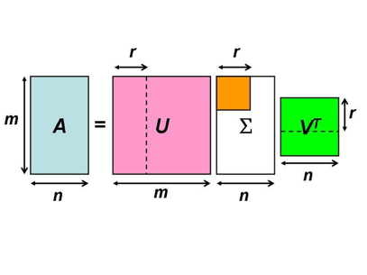
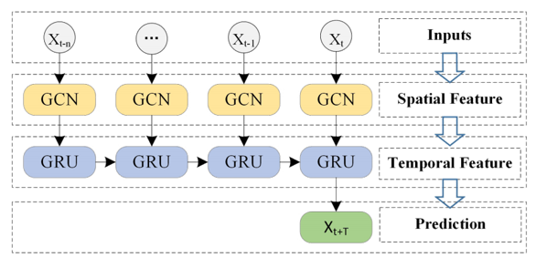
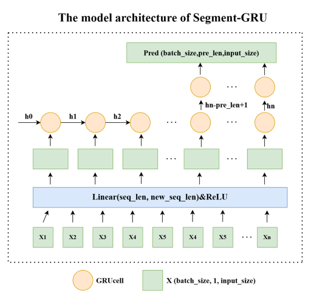

# Time Series Forecasting for Traffic Prediction

## Introduction
This project focuses on the application of machine learning techniques for time series forecasting in the context of traffic prediction, particularly addressing challenges posed by missing data and optimizing the model structure.

## Proposed Approach
The approach combines Singular Value Decomposition (SVD) imputation for handling missing values with advanced RNN models such as Gated Recurrent Units (GRU) and T-GCN models. This involves:

- **SVD Imputation**: In input tensor, missing values are replaced using Singular Value Decomposition to better capture underlying data structures.
- **SVD Imputation**: In output tensor, missing values are removed from the loss function calculation.

- **T-GRU Model**: Enhances prediction accuracy by incorporating spatial dependencies between traffic network nodes through graph convolutions.

- Parallel Computing: Utilizes the PyTorch DataLoader for parallel computing, which significantly boosts the performance of RNNs in long-term forecasting.

- **Hyperparameter Optimization**: Utilizes the Optuna library to fine-tune model parameters.

## Experiments
Three main experiments are conducted:
1. **GRU vs. T-GRU Performance**: Evaluates the effectiveness of spatial dependencies.
2. **Long-term Prediction**: Uses a sliced data processing approach and an encoder-decoder structure similar to transformers.
3. **Model Generalization**: Tests the model on a different dataset to explore transferability.

## Web Application
Developed using Flask and Flask-RESTX, the application provides a user-friendly interface for:
- Time series forecasting
- Model training
- Result visualization

## Conclusion
1. TGCN can enhance prediction performance compared to GRU.
2. SVD imputation of missing values improves predictive accuracy, and excluding missing values from the loss function makes predictions more aligned with reality.
3. Utilizing parallel computing significantly boosts the performance of RNNs in long-term forecasting.
4. Both TGCN and GRU models demonstrate a certain level of generalization ability, likely due to commonalities in traffic data.

## How to Run the Code

### Requirements
- Python 3.8+
- Libraries: numpy, pandas, torch, flask, flask-restx, optuna, notebook, scikit-learn, plotly, tqdm

### Running the Application
```bash
python app.py
```

This will start the Flask server and make the web application accessible locally for time series forecasting and visualization tasks.